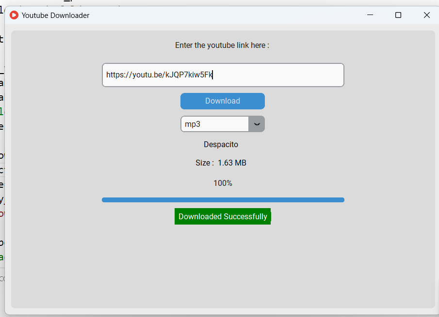
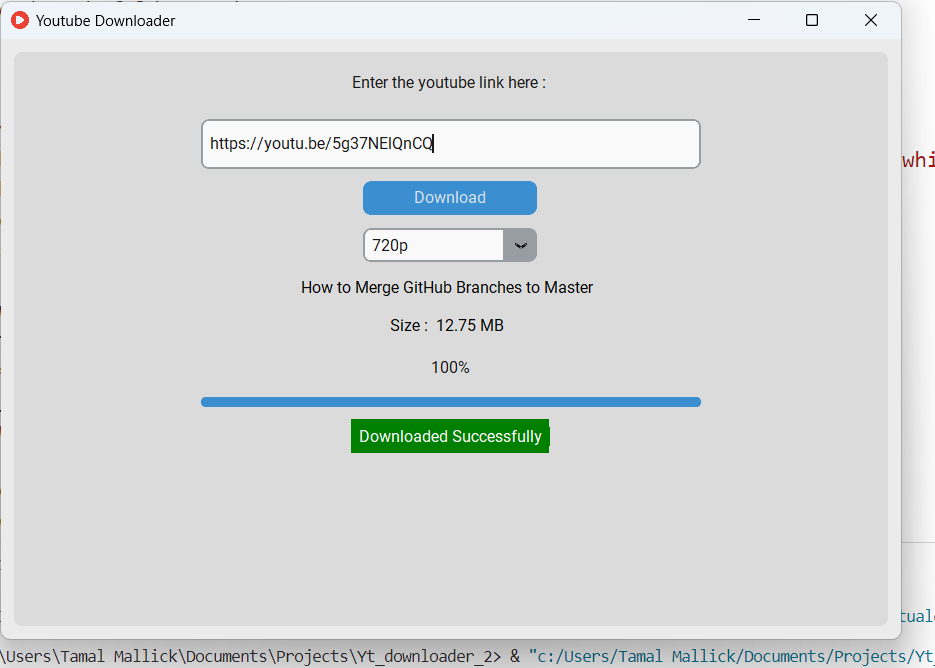

# YouTube Downloader


This repository contains a simple YouTube **downloader application** written in Python and its **setup file** for windods.

## Installation and Usage

### Step 0: Set Up Virtual Environment

```bash
python -m venv folder_name
```

### Step 1: Activate Virtual Environment

```bash
.\folder_name\Scripts\activate
```

### Step 2: Install Required Libraries
```bash

pip install -r version_requirements.txt
pip freeze > version_requirements.txt
```
### Step 3: Access Virtual Environment or Place Files
```bash

cd folder_name\Lib\site-packages
```
### Step 4: Run the Application
```bash

python app.py
```
### Step 5: Deactivate Virtual Environment
```bash

deactivate
```
### Installation on Windows

Double-click on ***YouDownloader_mysetup.exe*** to install the application.


#### Note: Ensure compliance with YouTube's terms of service regarding video downloading.
```bash

This README provides clear steps for setting up the virtual environment, installing required libraries, running the application, and also includes a note for Windows installation. Remember to replace `YouDownloader_mysetup.exe` with the actual name of your setup file. Additionally, ensure the disclaimer about compliance with YouTube's terms of service remains visible.

```